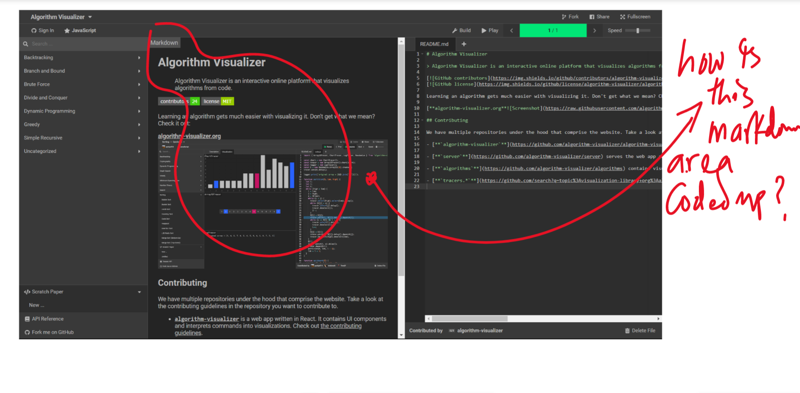
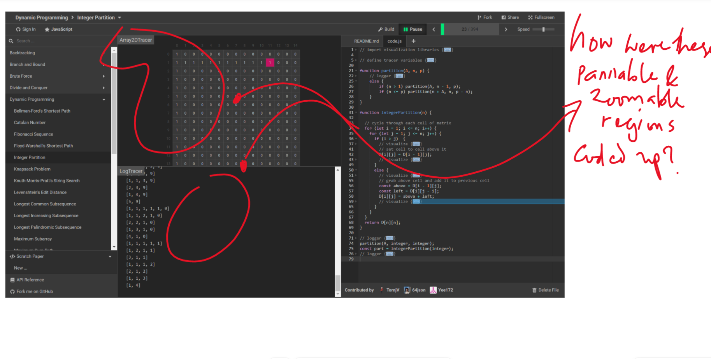
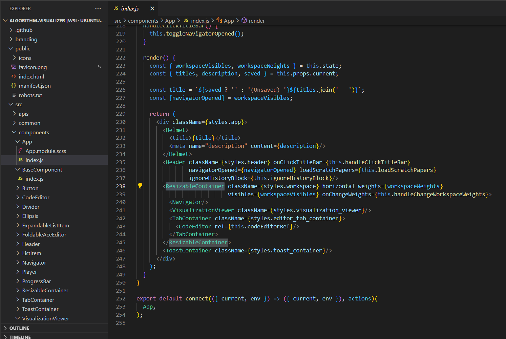
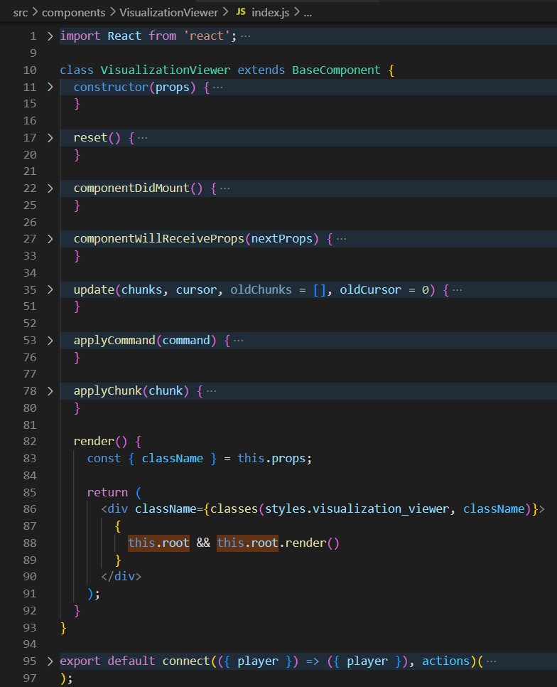
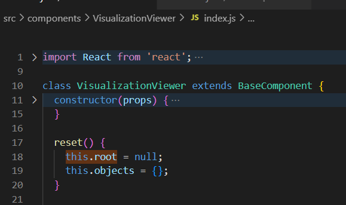
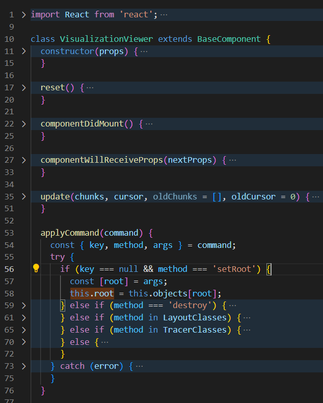
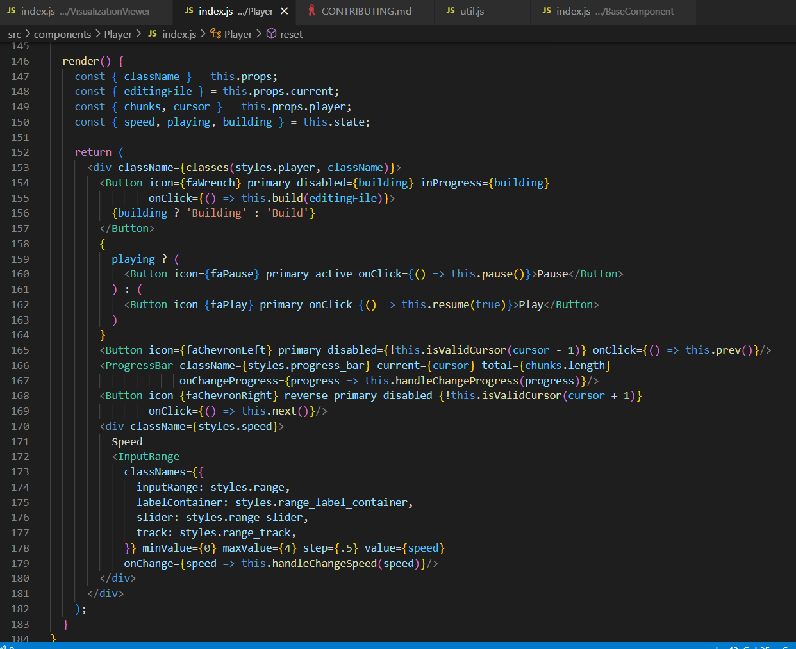
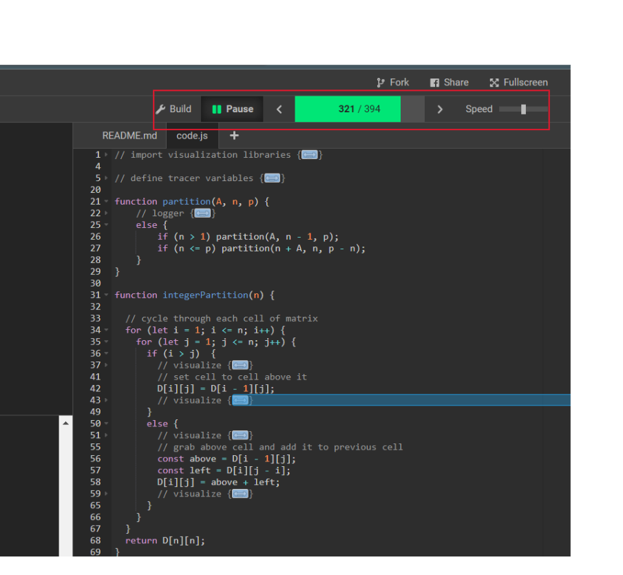

https://algorithm-visualizer.org/  

-  

- [[the directory for the algo-viz looks like this]]
- App's layout:
  - `<ResizableContainer>`
    - `<Navigator>`
    - `<VisualizationViewer>`
    - `<TabContainer`
      - `<CodeEditor>`
  - 

- how does `<VisualizationViewer>` work?
  - what is `this.root`?
    - 
    - 
    - 
    - where is `args` in `command` coming from?
      - `commands` are "visualizing commands"
      - "[**tracers/**](src/core/tracers) interprets visualizing commands into visualization data."
      - the components `Player` and `VisualizationViewer` have the most use of the word `command`
- the `<Player>`:
  - 
  - renders this:
    - 

